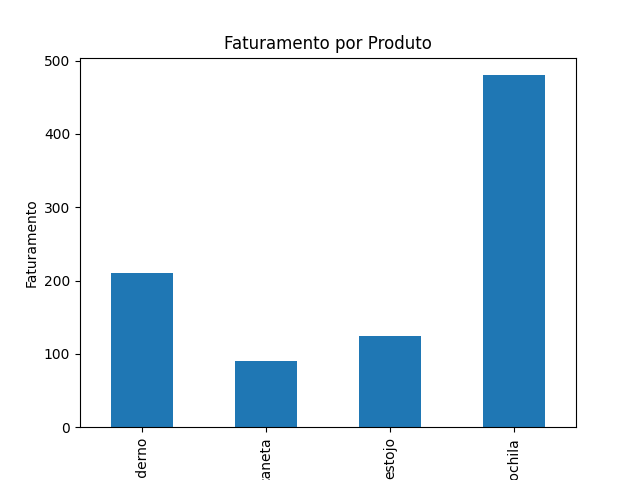

# Análise de Vendas - Lumina Retail

Este projeto apresenta uma análise exploratória de dados de vendas utilizando Python, com o objetivo de identificar padrões de consumo, produtos mais rentáveis e desempenho financeiro da loja fictícia **Lumina Retail**.

---

## Objetivo

Analisar dados de vendas para extrair insights relevantes sobre:

- faturamento total
- desempenho de produtos
- comportamento de vendas ao longo do tempo
- categorias mais lucrativas

---

## Tecnologias Utilizadas

- Python
- Pandas
- Matplotlib
- VS Code

---

## Estrutura do Projeto

analise-vendas-lumina-retail/

dados/  
  vendas_lumina.csv → base de dados de vendas  

scripts/  
  analise_lumina.py → script responsável pela análise  

notebooks/  
  (pasta reservada para análises futuras)

README.md → documentação do projeto

---

## Etapas da Análise

1. Leitura do dataset CSV
2. Conversão da coluna de data para datetime
3. Criação da métrica de faturamento
4. Cálculo de métricas agregadas
5. Identificação de produtos e categorias mais lucrativas
6. Análise temporal das vendas
7. Criação de visualização de faturamento por produto

---

## Resultados da Análise

### Faturamento Total

A loja gerou um faturamento total de:

**R$ 905**

---

### Faturamento por Produto

- Mochila: **R$ 480**
- Caderno: **R$ 210**
- Estojo: **R$ 125**
- Caneta: **R$ 90**

O produto mais lucrativo foi **mochila**, responsável por mais de 50% da receita total.

---

### Produto Mais Vendido

O item mais vendido em quantidade foi:

**Caneta — 18 unidades**

---

### Categoria com Maior Faturamento

A categoria **papelaria** apresentou o maior volume de vendas e faturamento.

---

### Melhor Dia de Vendas

O dia com maior faturamento foi:

**12/01/2024 — R$ 120**

---

### Ticket Médio

O ticket médio das vendas foi de aproximadamente:

**R$ 181 por venda**

---

## Visualização

### Faturamento por Produto

---

## Como Executar o Projeto

1. Baixar ou clonar o repositório
2. Abrir a pasta no VS Code
3. Executar no terminal:

python scripts/analise_lumina.py
